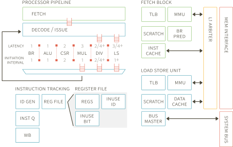

#Taiga

Taiga is a 32-bit RISC-V processor designed for FPGAs supporting the Multiply/Divide and Atomic extensions (RV32IMA).  The processor is written in SystemVerilog and has been designed to be both highly extensible and highly configurable.

The pipeline has been designed to support parallel, variable-latency execution units and to readily support the inclusion of new execution units.

##License

Taiga is licensed under the Apache License, Version 2.0 ( https://www.apache.org/licenses/LICENSE-2.0 )

##Examples
A zedboard configuration is provided under the examples directory along with tools for running stand-alone applications and providing application level simulation of the system.  (See the README in the zedboard directory for details.)

##Publications
E. Matthews and L. Shannon, "TAIGA: A new RISC-V soft-processor framework enabling high performance CPU architectural features," 2017 27th International Conference on Field Programmable Logic and Applications (FPL), Ghent, Belgium, 2017. [https://doi.org/10.23919/FPL.2017.8056766](https://doi.org/10.23919/FPL.2017.8056766)