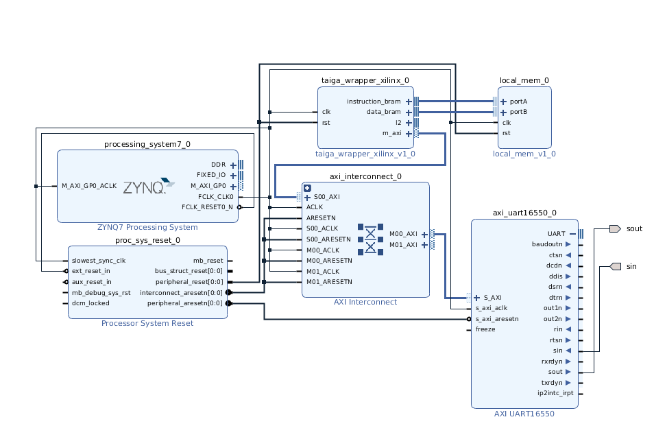
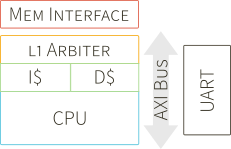

Creating a Project for the Zedboard
================

    1. Select the zedboard as your board in Vivado
    2. import the provided board constraints (.xdc file)

Building the core on the Zedboard
-----
Tested on Vivado 2018.3 on a Linux System
### Building Taiga and Local Memory IP Cores
In Vivado's TCL Console, change its directory to within the cloned Taiga repository:

    cd <path to Taiga repo location>/Taiga
    
Build the Taiga  IP Package by calling:
    
    source scripts/xilinx/taiga_wrapper_IP.tcl
    
Build the Local Memory Package by calling:

    source scripts/xilinx/local_memory_IP.tcl

These commands will create separate Vivado projects, check if the packaging was successful. In the "Package IP" tab, navigate to the "Review and Package", a succesfully built IP core with have a Re-Package IP button at the bottom.

Both a Successful and failed build will create IP core folders(taiga_wrapper_IP and local_memory_IP) within the Taiga directory.

Note: If for some reason, it neccesary to run the scripts again, always delete the the IP core folder of the core that will be rebuilt, as Vivado is unable to overwrite these files otherwise.

### Adding Taiga and Local Memory IP Cores to the project
In either the existing Vivado project or a new Vivado project configured to run on a zedBoard, open the "IP Catalog".

If starting a new project make sure to add the .xdc file provided as constraints and choose zedBoard as the project board.

Add the IPs, by right-clicking on the Catalog Window, select "Add Repository..." and direct it to the Taiga Repository.

There should now be a User Repository that contains the cores:

local_mem_v1_0 and taiga_wrapper_xilinx_v1_0

### Creating the Hardware Block Diagram and configuring IP Cores:
Create a new Block Design by selecting "Create Block Design" in Vivado's Flow Navigator.
Add the following IP cores:

    1. taiga_wrapper_xilinx_v1_0
    2. local_mem_v1_0
    3. ZYNQ7 Processing System
    4. Processor System Reset
    5. AXI UART16550
Note: There will be an AXI Interconnect added later on, but it has to be done after all other cores have been connected.

Configure the **Local Memory** to use a Preloaded File, by double-cliking on the core and setting "Use Preload File" to 1 and copy the file path to the hw_init file provided.
Leave "Ram Size" to 64.

Configure the **ZYNQ7 Processing System** to output an FCLK_CLK of 100Mhz. This can be set in the IP's "Clock Configuration" under "PL Fabric Clocks:. Ensure there is at least 1 FCLK enabled and its Requested Frequency is 100Mhz.

### Connecting the IP Cores Together:
Connect the **FCLK_CLK** output from the ZYNQ to all the cores' clk input, connect it as well to the ZYNQ's M_AXI_GP0_ACLK and the Processor System Reset's slowest_sync_clk. This is done by hovering your mouse over the port until it changes to a pencil symbol then click and drag to the clk ports.

Connect the **FCLK_RESET_N** output from the ZYNQ to the Processor System Reset's ext_reset_in.

Connect the **perpheral_aresetn** output from the Processor System Reset to the AXI Uart's aresetn pins.

Connect the **perpheral_areset** output from the Processor System Reset to the Local Memory and Taiga's reset  pins.

Connect the **instruction_bram and data_bram** output from Taiga to the Local Memory's portA and portB inputs, respectively.

Set the UART's **sin and sout** pins to external. This is done by expanding the UART output by clicking on the "+" Symbol right beside it then rightclicking on the sin and sout pin and selecting the "Make External Option". Change the name of the external port to "sin" and "sout" instead of "sin_0" and "sout_0".

### Autogenerate the HDL Wrapper for this Block Design:
Under Sources, right click on the design_1.bd file, and select generate HDL Wrapper and let Vivado auto-generate one. 

Set the newly generated as the Top file which is one of the options if you right click on the HDL Wrapper.

### Adding and Connecting the AXI Interconnect IP Cores:
The Interconnect is **added after everything else has been setup and the HDL wrapper has been generated** to help mitigate some errors that prevent the synthesis of the system.

Add the core AXI Interconnect (Not AXI Smartconnect).

Configure the **AXI Interconnect** to use "Maximize Performance" as its "Optimization Strategy". This requires the interconnect to **not** be a 1-to-1 interconnect even if functionally it only connects the Taiga core to the UART. This can be done by setting either the Number of Slave or Master Interfaces to 2.

This was done because Vivado would optimized neccesarry signals away that would cause the interconnect to fail to transfer requests from the Taiga to the UART. This is the same reason as to why the AXI Smartconnect is not used.

Connect the **interconnect_aresetn** output from the Processor System Reset to the AXI Interconnect aresetn pins.

Connect the **m_axi** output from Taiga to the AXI Interconnect's S00_AXI input.

Connect the **M00_AXI** output from the AXI Interconnect to the UART's S_AXI input.

Set the UART's **slave address** to 0x6000_0000. This is done by Navigating to the Address Editor, finding "S_AXI" under taiga_wrapper_xilinx_0 -> m_axi -> Unmapped Slaves, righting clicking and "Assign Address". Then changing "Offset Address" to 0x6000_0000. Range can stay at 64K.

This is an approximation of what the connections should look like:

### Sythesize Design:
From the Flow Navigator, run Generate Bitstream.

### Bringing the Zedboard out of reset:
This must be done each time to board is turned on or if the processor clocks were changed. If the zedBoard will be programmed through Xilinx SDK and not Vivado, this is not needed.

It must be done **after the synthesis** phase as the required file will be updated then.

Find the path to processing system IP core within the Vivado project directory. You are trying to look for ps7_init.tcl It will often look something like:

    <path to Vivado project>/Taiga.srcs/sources_1/bd/design_1/ip/design_1_processing_system7_0_0/ps7_init.tcl
    
in the terminal you sourced and launched vivado, open xsdb. Input the follow commands:

    connect
    target 1
    rst
    source <path to Vivado project>/Taiga.srcs/sources_1/bd/design_1/ip/design_1_processing_system7_0_1/ps7_init.tcl
    ps7_init
    ps7_post_config

### Connected the UART through a PMOD:
This project is set to use a serial PMOD connected to JA ports on the zedBoard. Connect the UART PMOD to your PC. Use your software of choice to listen on the apporpriate port with a 115200 Baud Rate.

A simple one to use is "screen" which can be installed on most systems.

Use the command:
    screen /dev/ttyUSB0 115200
    
Note: **ttyUSB0 might be different** on your setup depending on how you choice to connect the UART. You also might have to run it as root.

This is where the UART output can be seen.

### Program the ZedBoard:
Program the ZedBoard with the generated bitstream. This can be done from the Flow Navigator, select Hardware Manager. Press the "Auto Connect button".

rightclick on the xc7z020_1 and select "Program Device". Confirm that it is the correct bitstream file, then click program. This will begin running the binnaries loaded onto the local memory. By default, it will be running the Dhrystone benchmarks.

[OLD]Creating a Project for the Zedboard
================

    1. Select the zedboard as your board in Vivado and import standard board constraints
    2. Add Taiga core and l2 arbiter sources to the project
    3. Add the taiga_wrapper.sv from the zedboard directory
    4. Add the Xilinx specific components which are generated through tcl scripts. From the Tcl Console run:
        source <path to>/arm.tcl
        source <path to/>system_peripherals.tcl

System Configuration
-----
For this example system, the AXI bus interface is enabled for Taiga, and a UART is connected to the bus.  The memory interface is through the L2 arbiter to a High Performance Port on the ARM.

Simulation
-----------
For application level simulation we have provided a top level system wrapper: taiga_tb.sv, a waveform conifuration file and a python script to convert riscv binaries into a input usable for the simulation.
 
To simulate the system add all the sources in the simulation folder.  Set taiga_tb.sv as the top level entity and update the following two lines with paths to your benchmark simulation file and your uart output log file.  For testing purposes we have included a dhrystone.riscv.sim_init file that can be used to verify that the design has been correctly configured.

    `define  MEMORY_FILE  "<path to sim_init file>"
    `define  UART_LOG  "<output log>"

Additionally, add the waveform config file to your project which includes many of the key control signals within Taiga and allows for the observation of program execution.  The testbench waveform is configured to show the dissasembly of the program as it executes to aid in debugging and unsderstanding of instruction flow within Taiga.

The simulation will run for a set amout of time units which can be modified by changing the 1200000 value below.

    initial begin
        simulator_clk = 0;
        interrupt = '0;
        simulator_resetn = 0;
                
        simulation_mem.load_program(`MEMORY_FILE, RESET_VEC);
        
        output_file = $fopen(`UART_LOG, "w");
        if (output_file == 0) begin
            $error ("couldn't open log file");
            $finish;
        end
        do_reset();

        #1200000;
        $fclose(output_file);
        $finish;
    end

Upon reaching finish, the simulator will flush the buffer to the output file and the uart log can be checked.  If the simulation is stopped early, the output_file will not show all/any writes to the UART.

Building Software
-----------
To build stand-alone software you will need to build the risc-v gcc toolchain and riscv-tests:
[https://github.com/riscv/riscv-tools](https://github.com/riscv/riscv-tools)

Build the tools for a RV32IMA configuration.  To build new stand-alone applications the benchmarks in the riscv-tests can be used as a starting point.

### Changes Required
In order to build your own applications you will need to make a few small modifications to the setup in the riscv-tests/benchmarks directory.

In the riscv-tests/benchmarks/Makefile, make sure XLEN is set to 32, and add -DHOST_DEBUG=0 to the RISCV_GCC_OPTS.

In riscv-tests/benchmarks/common/crt.S the default stack size is 128KB which would well exceed a reasonable BRAM configuration.  To change the stack size change the the STKSHIFT define.  For 2KBs, set the value to 11.

For UART support you will need to modify the riscv-tests/benchmarks/common/syscalls.c file, specifically, the putchar function.  Replace this function with one that sends a character to the UART.

### Creating the simulation and BRAM init files
To create the inputs for simulation, use the taiga_binary_converter.py (from the tools directory) on the resulting binaries to create inputs for simulation and BRAM initialization for hardware.

The taiga_binary_converter.py script requires the following inputs:

    python3 taiga_binary_converter.py <riscv-gcc-prefix> <base addr> <ram size in bytes> <input binary> <output BRAM init file> <output Simulation init file>

Here is an example set of inputs for the script:

    python3 taiga_binary_converter.py riscv32-unknown-elf- 0x80000000 65536 dhrystone.riscv  dhrystone.riscv.hw_init  dhrystone.riscv.sim_init

