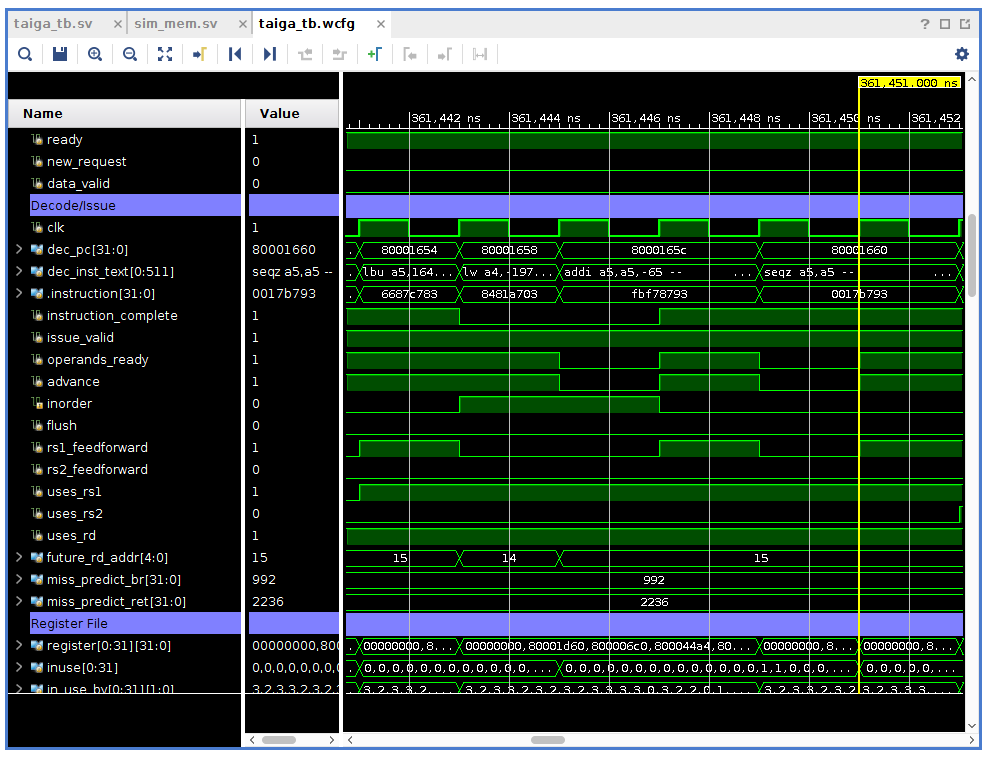

Creating a Hardware Project for the Zedboard
-----------

We have provided a TCL script that automates the creation of a Taiga system on a zedBoard through Vivado.
We also provide the manual steps that the script automate.

Script and steps found here:  [Hardware Setup](https://gitlab.com/sfu-rcl/Taiga-dev/-/wikis/Hardware-Setup)

Simulation
-----------
For application level simulation we have provided a top level system wrapper: taiga_tb.sv, a waveform conifuration file and a python script to convert riscv binaries into a input usable for the simulation.
 
To simulate the system add all the sources in the simulation folder.  Set taiga_tb.sv as the top level entity and update the following two lines with paths to your benchmark simulation file and your uart output log file.  For testing purposes we have included a dhrystone.riscv.sim_init file that can be used to verify that the design has been correctly configured.

    `define  MEMORY_FILE  "<path to sim_init file>"
    `define  UART_LOG  "<output log>"

Additionally, add the waveform config file to your project which includes many of the key control signals within Taiga and allows for the observation of program execution.  The testbench waveform is configured to show the dissasembly of the program as it executes to aid in debugging and unsderstanding of instruction flow within Taiga.

The simulation will run for a set amout of time units which can be modified by changing the 1200000 value below.

    initial begin
        simulator_clk = 0;
        interrupt = '0;
        simulator_resetn = 0;
                
        simulation_mem.load_program(`MEMORY_FILE, RESET_VEC);
        
        output_file = $fopen(`UART_LOG, "w");
        if (output_file == 0) begin
            $error ("couldn't open log file");
            $finish;
        end
        do_reset();

        #1200000;
        $fclose(output_file);
        $finish;
    end

Upon reaching finish, the simulator will flush the buffer to the output file and the uart log can be checked.  If the simulation is stopped early, the output_file will not show all/any writes to the UART.

Building Software
-----------
To build stand-alone software you will need to build the risc-v gcc toolchain and riscv-tests:
[https://github.com/riscv/riscv-tools](https://github.com/riscv/riscv-tools)

Build the tools for a RV32IMA configuration.  To build new stand-alone applications the benchmarks in the riscv-tests can be used as a starting point.

### Changes Required
In order to build your own applications you will need to make a few small modifications to the setup in the riscv-tests/benchmarks directory.

In the riscv-tests/benchmarks/Makefile, make sure XLEN is set to 32, and add -DHOST_DEBUG=0 to the RISCV_GCC_OPTS.

In riscv-tests/benchmarks/common/crt.S the default stack size is 128KB which would well exceed a reasonable BRAM configuration.  To change the stack size change the the STKSHIFT define.  For 2KBs, set the value to 11.

For UART support you will need to modify the riscv-tests/benchmarks/common/syscalls.c file, specifically, the putchar function.  Replace this function with one that sends a character to the UART.

### Creating the simulation and BRAM init files
To create the inputs for simulation, use the taiga_binary_converter.py (from the tools directory) on the resulting binaries to create inputs for simulation and BRAM initialization for hardware.

The taiga_binary_converter.py script requires the following inputs:

    python3 taiga_binary_converter.py <riscv-gcc-prefix> <base addr> <ram size in bytes> <input binary> <output BRAM init file> <output Simulation init file>

Here is an example set of inputs for the script:

    python3 taiga_binary_converter.py riscv32-unknown-elf- 0x80000000 65536 dhrystone.riscv  dhrystone.riscv.hw_init  dhrystone.riscv.sim_init

